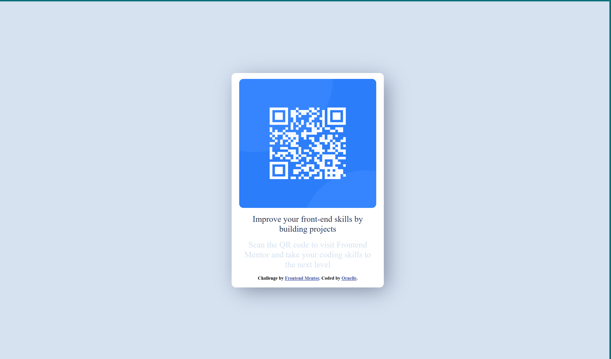

This is a beginner friendly challenge from front-end mentor.[QR code component challenge on Frontend Mentor](https://www.frontendmentor.io/challenges/qr-code-component-iux_sIO_H)

[Frontend Mentor](https://www.frontendmentor.io) challenges help you improve your coding skills by building realistic projects.

This was done with basic knowledge of HTML and CSS.

The challenge was to build out this QR code componet and get it looking as close to the design as possible in the design folder as possible.

This is a solution to the [QR code component challenge on Frontend Mentor](https://www.frontendmentor.io/challenges/qr-code-component-iux_sIO_H). Frontend Mentor challenges help you improve your coding skills by building realistic projects. 

## Table of contents

- [Overview](#overview)
  - [Screenshot](#screenshot)
- [My process](#my-process)
  - [Built with](#built-with)
  - [Useful resources](#useful-resources)
- [Author](#author)

## Overview

### Screenshot

.

## My process
I used HTML5 markup with some basic knowledge of css.

First by using border property on all elements to be able to distinguish the positions of every element while they where being added.

### Built with

- Semantic HTML5 markup
- CSS custom properties

If you want more help with writing markdown, we'd recommend checking out [The Markdown Guide](https://www.markdownguide.org/) to learn more.

**Note: Delete this note and the content within this section and replace with your own learnings.**

### Useful resources

I learned basic html and css from freecodecamp.

## Author

- Frontend Mentor - [@Blackysynch](https://www.frontendmentor.io/profile/Blackysynch)
- Twitter - [@ornelle_o](https://twitter.com/ornelle_o)